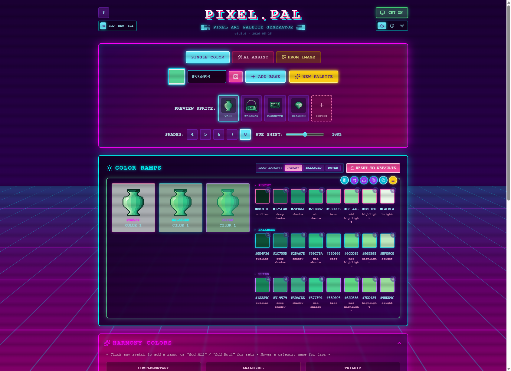

# PIXEL.PAL

Color palette generator for pixel art. Takes a base color, text description, or image and produces sorted color ramps in three contrast styles: Punchy, Balanced, and Muted.




## Try It In Your Browser

No install, no download: **[tito13kfm.github.io/pixel-pal-app](https://tito13kfm.github.io/pixel-pal-app/)**

The web version is feature-complete for everything except a few desktop-only conveniences (see [Web vs Desktop](#web-vs-desktop) below). Open the link, paste a hex color or an image, generate ramps, export `.txt` or `.gpl`. Your palettes save to browser local storage, so they persist across visits on the same browser profile.

The hosted build is rebuilt and deployed on every tagged release.

## Download (Desktop)

Pre-built installers for Windows, macOS, and Linux are on the [Releases page](https://github.com/tito13kfm/pixel-pal-app/releases). A standalone portable Windows `.exe` (no installer, no auto-update) ships in each release as `PIXEL.PAL_<version>_x64-portable.exe`.

The desktop build adds OS-keychain key storage, native Save As dialogs, in-app auto-update, and support for AI providers the browser can't reach (Anthropic, local Ollama).

## Features

**Input**
- Single hex color: type, pick, or roll random
- Image upload, paste, or drag-and-drop: extracts 3-6 dominant colors; eyedropper with up to 8x zoom lets you click individual pixels
- AI Assist: describe a subject and a language model picks the colors; "Surprise Me" has the AI invent a subject too
- Example ramps inspired from classic palettes: DawnBringer 16, PICO-8, Sweetie 16, Game Boy, NES Super Mario Bros, EDG32, CGA, and more.
  - (These are to emulate a feel of the palette, not full palettes.  Intentional design choice, trust me you dont't want 12000+ color swatches showing at once)
- Import GIMP .gpl files

**Output**
- 4-8 shade ramps with pixel-art slot labels (outline, shadow, base, highlight, bright)
- Three contrast styles per ramp: Punchy, Balanced, Muted
- Perceptual OKLCH engine: lightness-uniform shading, predictable contrast
- Hue shift built in: shadows lean cool, highlights lean warm; strength is adjustable

**Per-ramp controls**
- H/S/V sliders adjust the base color, then the engine derives shades from there
- Saturation multiplier
- Per-shade count override
- Pin individual shades to a fixed hex across all three styles
- Right-click a shade to hide it across all three styles
- Lock ramp from global operations
- **Advanced disclosure** (closed by default): interactive lightness curve editor and saturation curve editor (drag anchors, click to add, preset chips for one-click shapes), plus gamut strategy (auto / clip / chroma-preserve)

**Global tools**
- Harmonize: rotate unlocked ramps to color-theory positions relative to an anchor ramp
- Color harmony derivation: complementary, analogous, triadic, split-complementary, tetradic, square
- Hardware Lock: snap all shades to the nearest legal color (perceptual ΔE_OK distance) for NES, Game Boy DMG, CGA 16, EGA 64, or C64

**Image tools**
- Remap any uploaded image to your active palette, with optional Floyd-Steinberg dithering
- Side-by-side view of original vs. palette-remapped image
- Export the remapped image at multiple scale options

**Views**
- Mosaic preview
- Lightness distribution strip
- Chromatic polar plot
- Sprite previews on 4 built-in 32x32 sprites; import custom sprites from Piskel
- Side-by-side palette comparison

**Accessibility**
- WCAG contrast check with Compare Mode: click any two swatches to see their contrast ratio
- Color vision deficiency simulation: protanopia, deuteranopia, tritanopia

**State and export**
- Up to 100 saved palettes in local storage
- 50-entry session history with undo, redo, and direct jump to any point
- Three themes: Dark, Neutral, Light (persists across sessions)
- Auto-updates: desktop checks for new releases and prompts you to install; web reflects the latest deploy on refresh
- Export: plain text or GIMP .gpl with Punchy, Balanced, or Muted style selectable

## Getting Started

### Prerequisites

For running a downloaded release: nothing extra on Windows or macOS. Linux requires runtime libraries (see Linux section below).

For building from source:
- Node.js 20+
- Rust (stable) from [rustup.rs](https://rustup.rs)
- macOS: Xcode Command Line Tools (`xcode-select --install`)

### Install and Run from Source

```bash
git clone https://github.com/tito13kfm/pixel-pal-app.git
cd pixel-pal-app
npm install

# Desktop app
npm run tauri:dev

# Browser dev server (plain browser, no Tauri)
npm run dev
```

### Build

```bash
npm run build         # type-check + Tauri-targeted web assets (base './')
npm run build:web     # static build for GH Pages hosting (base '/pixel-pal-app/')
npm run dist          # packaged desktop installer, output to src-tauri/target/release/bundle/
```

## AI Assist

AI Assist sends your prompt to a language model of your choice and extracts a palette from the response. Your API key never leaves your machine.

**Desktop:** key stored in the OS keychain (Windows Credential Manager on Windows, Keychain on macOS, Secret Service on Linux). Supported providers: OpenAI, Anthropic, Google Gemini, xAI Grok, OpenRouter, Ollama (local), and any OpenAI-compatible endpoint.

**Browser:** key stored in browser local storage on the device (the app shows a notice). Supported providers in the browser dropdown: OpenAI, Google Gemini, xAI Grok, OpenRouter, and custom OpenAI-compatible endpoints. Anthropic is omitted because its API does not allow direct browser calls; Ollama is omitted because the hosted site is HTTPS and cannot reach `http://localhost:11434`. Use the desktop app for those two.

Configure in Settings on first launch.

## Web vs Desktop

| Feature | Web | Desktop |
| --- | --- | --- |
| Generate ramps, edit, save palettes | yes | yes |
| Export `.txt` / `.gpl` | yes (anchor download to Downloads folder) | yes (native Save As, remembers folder per file type) |
| AI providers: OpenAI / Gemini / xAI / OpenRouter / custom | yes | yes |
| AI providers: Anthropic | no (CORS) | yes |
| AI providers: Ollama (local) | no (mixed-content) | yes |
| API key storage | browser localStorage (plaintext, per-profile) | OS keychain |
| Auto-update | automatic on page refresh (always the latest deploy) | in-app update prompt |
| Offline use | no | yes (once installed) |
| Install required | no | yes |

## What This Is Not

- Not a pixel art editor. Use Aseprite, Piskel, or Pixelorama for painting.
- Not a cloud service. Palettes save to local storage, no account required.
- Not a hardware accuracy tool for emulation. Hardware palettes are artist references, not bit-exact captures.

## Linux Requirements

For the pre-built release, install these runtime libraries:

```bash
sudo apt-get install libwebkit2gtk-4.1-0 libsecret-1-0
```

For building from source, you need the development packages:

```bash
sudo apt-get install libwebkit2gtk-4.1-dev librsvg2-dev patchelf libsecret-1-dev
```

`libsecret` is required for encrypted API key storage. Without it, the app falls back to unencrypted local storage.

For non-Debian/Ubuntu distributions, install the equivalent packages: WebKit2GTK 4.1 runtime, libsecret runtime (and their -dev variants for building).

## Windows Notes

Windows 11 and most Windows 10 installations include WebView2 (required by Tauri). If the app fails to launch on Windows 10, install the [WebView2 runtime](https://developer.microsoft.com/en-us/microsoft-edge/webview2/) from Microsoft.

## AI Assistance

This project was built with AI coding assistance. AI was used for code generation, refactoring, testing, and debugging throughout development.

All artwork in project is human created by me, except that one diamond sprite.  I borrowed that from Stardew Valley.  I hope Concerned Ape doesn't mind.

## License

MIT
